# HelpDesk

## Descripcion del Proyecto

**HelpDesk** es una plataforma de mesa de ayuda basada en microservicios que permite:
- Gestionar empleados y consultar su resumen operativo
- Gestionar activos del inventario tecnologico
- Crear y consultar tickets asociados a empleados y activos
- Integrar servicios entre si mediante descubrimiento con Consul
- Exponer APIs documentadas con Swagger/OpenAPI

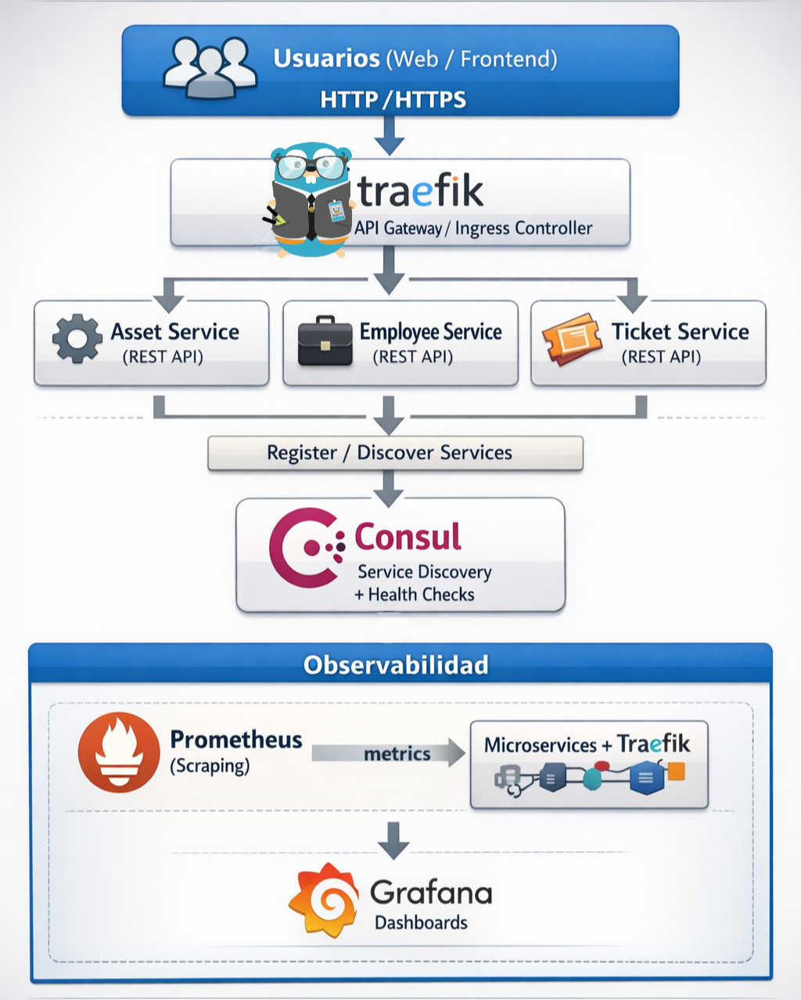

### Caracteristicas Principales

#### Backend
- Arquitectura de microservicios con `app-employee`, `app-asset` y `app-ticket`
- APIs REST en Quarkus y Spring Boot
- Persistencia con PostgreSQL + JPA/Hibernate/Panache
- Migraciones de base de datos con Flyway por servicio y por schema
- Integracion entre servicios por REST Client (Quarkus) y Service Discovery (Consul/Stork)
- Documentacion de endpoints con Swagger/OpenAPI

#### Infraestructura y despliegue
- Orquestacion local con Docker Compose
- Reverse proxy y enrutamiento con Traefik
- Registro y descubrimiento de servicios con Consul
- Observabilidad con Prometheus y Grafana
- Manifiestos de despliegue para Kubernetes/OpenShift en `deployment/k8s`

#### Evidencias visuales
- Despliegue en OpenShift (3 servicios + Grafana + Traefik)
- Entorno local con Docker Compose (Consul, Traefik, Grafana)
- Swagger de cada microservicio

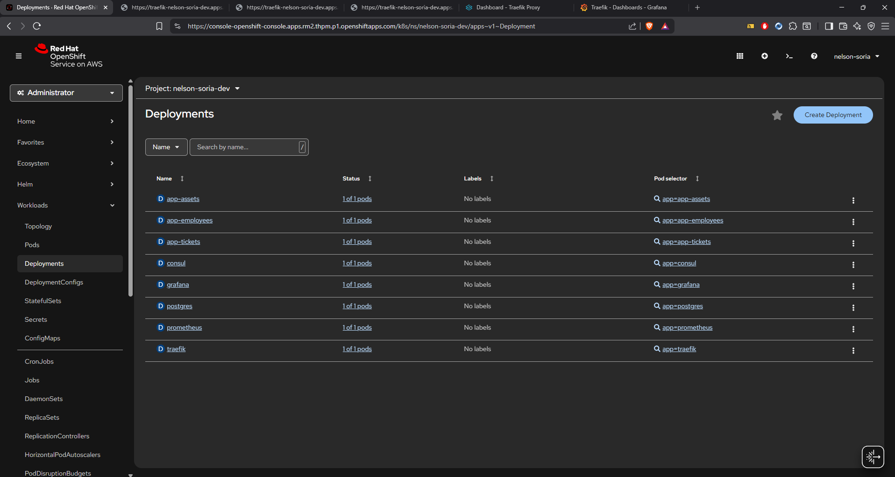
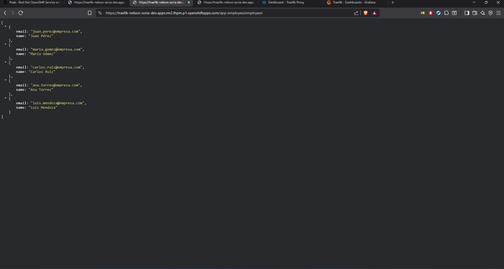
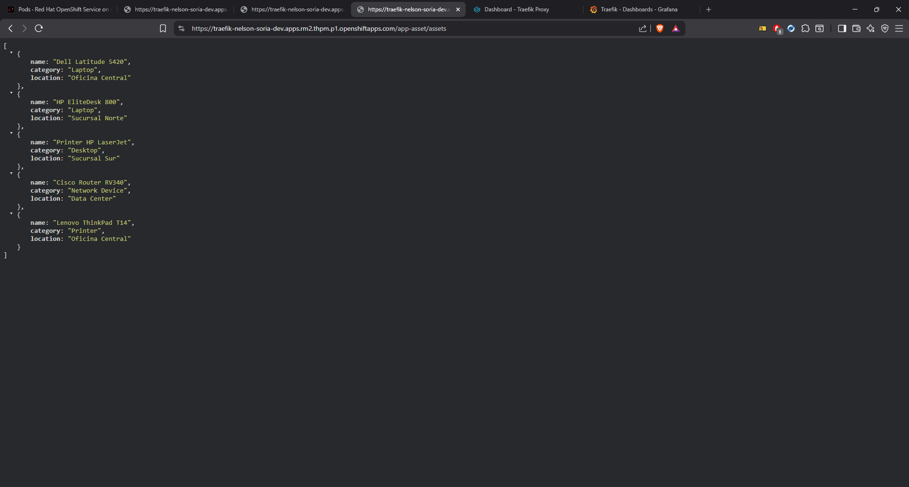
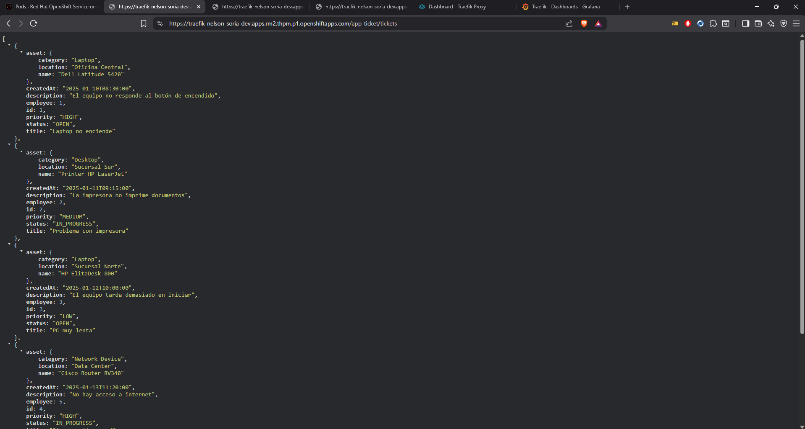
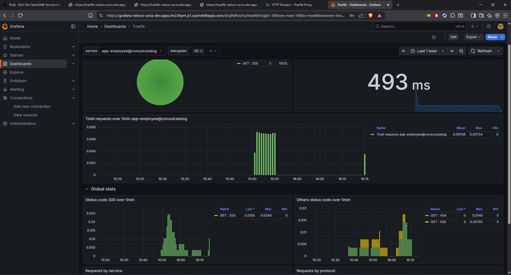
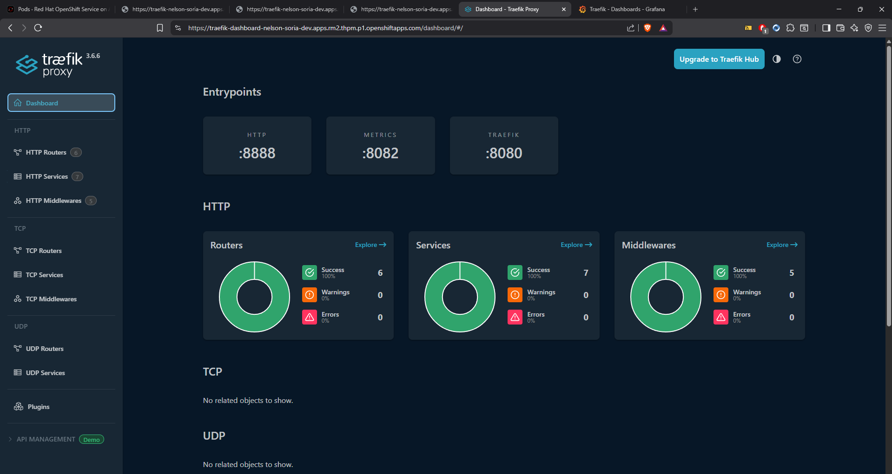
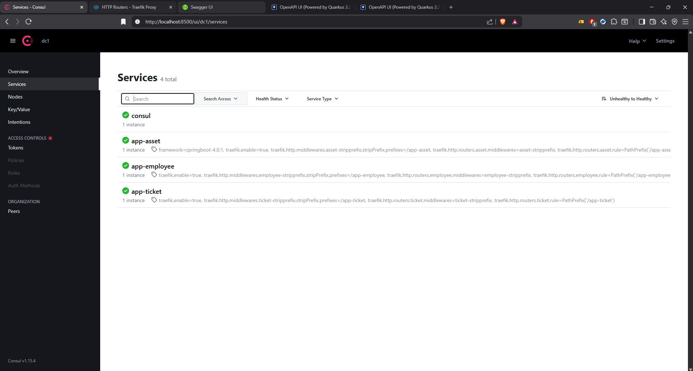
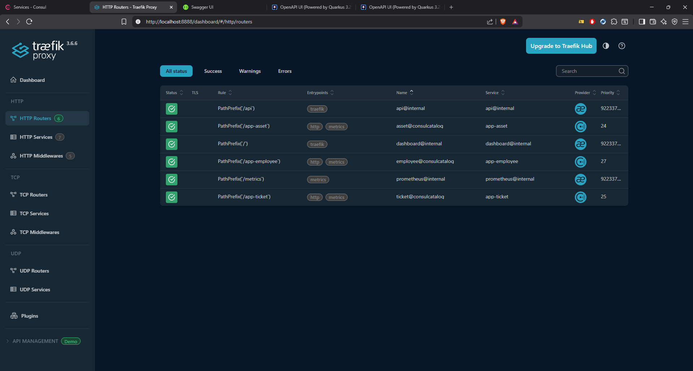
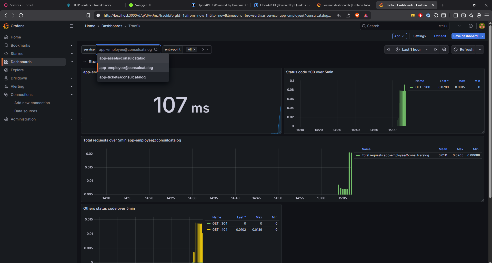
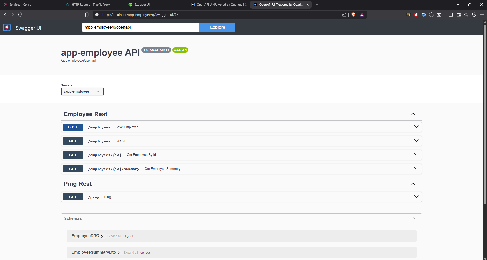
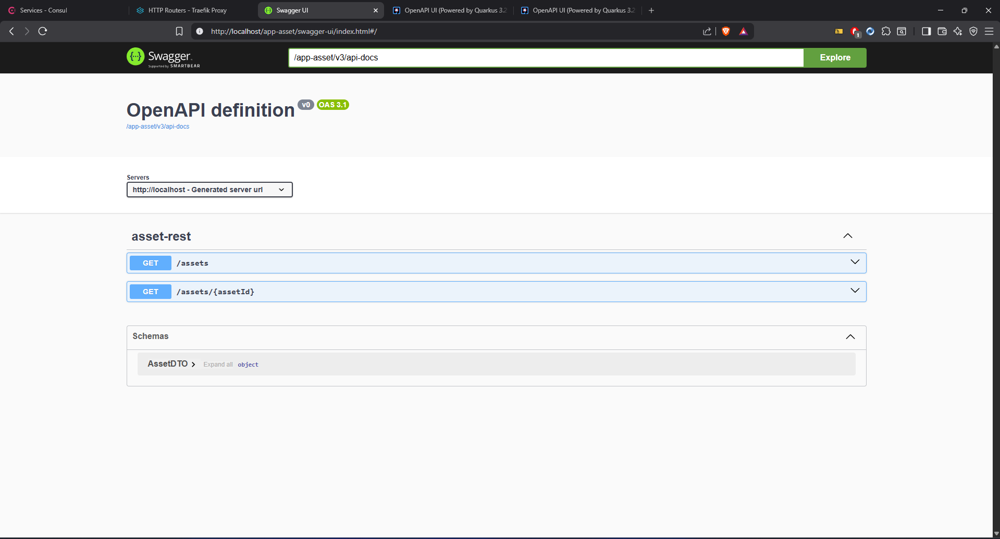
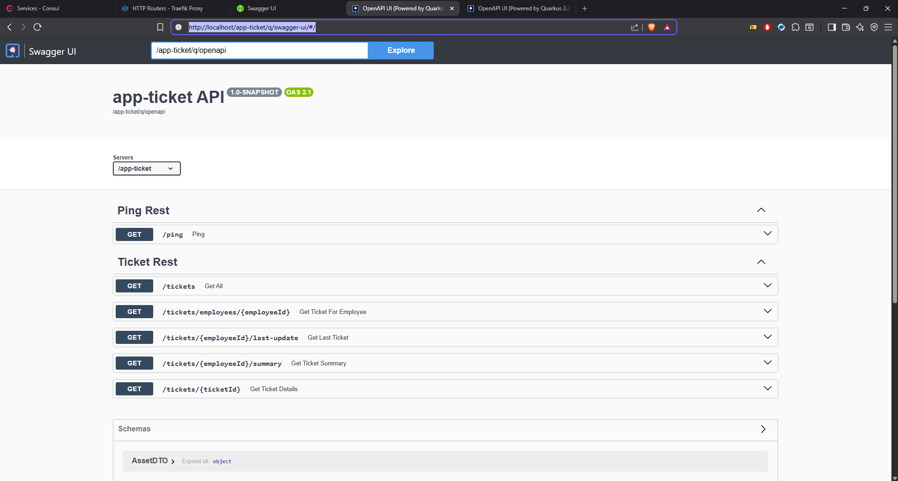
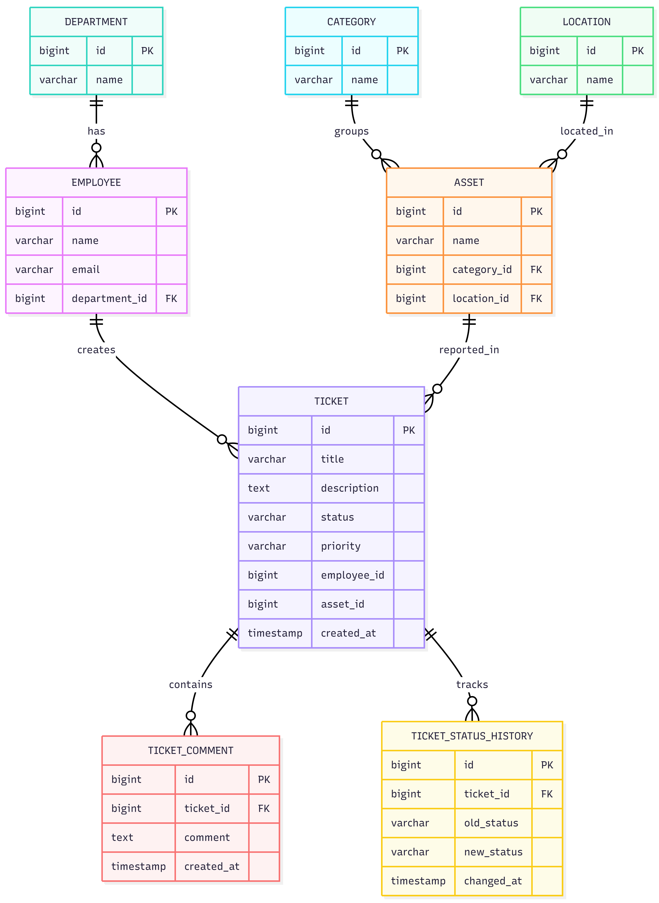

## Arquitectura

El proyecto está organizado en 3 servicios:

- `app-employee` (Quarkus): gestión de empleados.
- `app-asset` (Spring Boot): gestión de activos.
- `app-ticket` (Quarkus): gestión de tickets y consulta de empleados/activos vía REST.

Infraestructura de soporte:

- PostgreSQL
- Consul (service discovery)
- Traefik (reverse proxy)
- Prometheus y Grafana (observabilidad)

## Estructura del repositorio

```text
.
├── app-employee
├── app-asset
├── app-ticket
└── deployment
    ├── helpdesk-system/docker-compose.yml
    └── k8s
```

## Tecnologías

- Java 21
- Gradle (Kotlin DSL)
- Quarkus
- Spring Boot
- PostgreSQL + Flyway
- Consul + Stork/Spring Cloud Consul
- OpenAPI/Swagger

## Requisitos

- JDK 21
- Docker y Docker Compose (opcional, recomendado para entorno completo)
- PostgreSQL y Consul si ejecutas servicios sin Docker Compose

## Configuración rápida (opción recomendada)

Levanta toda la plataforma desde `docker-compose`:

```bash
cd deployment/helpdesk-system
docker compose up -d
```

Servicios expuestos:

- Traefik: `http://localhost`
- Dashboard Traefik: `http://localhost:8888`
- Consul UI: `http://localhost:8500`
- Prometheus: `http://localhost:9090`
- Grafana: `http://localhost:3000`
- App-Asset:`http://localhost/app-asset/assets`
- App-Employee:`http://localhost/app-employee/employees`
- App-Ticket:`http://localhost/app-ticket/tickets`
- PostgreSQL: `localhost:54321` (DB: `helpdesk`, user: `postgres`, pass: `postgres`)

## Ejecución local por módulos (sin Docker Compose)

Desde la raíz del proyecto:

```bash
# Linux/macOS
./gradlew :app-asset:bootRun
./gradlew :app-employee:quarkusDev
./gradlew :app-ticket:quarkusDev

# Windows (PowerShell)
.\gradlew.bat :app-asset:bootRun
.\gradlew.bat :app-employee:quarkusDev
.\gradlew.bat :app-ticket:quarkusDev
```

Puertos por defecto:

- `app-asset`: `8070`
- `app-employee`: `8085`
- `app-ticket`: `8090`

Nota: los `application.properties/yml` usan credenciales locales (`postgres/admin`) en algunos módulos. Si usas Docker Compose, ajusta variables de entorno o propiedades para unificar credenciales.

## Endpoints principales

### Employee Service

- `GET /employees`
- `GET /employees/{id}`
- `GET /employees/{id}/summary`
- `POST /employees`

### Asset Service

- `GET /assets`
- `GET /assets/{assetId}`

### Ticket Service

- `GET /tickets`
- `GET /tickets/employees/{employeeId}`
- `GET /tickets/{ticketId}`
- `GET /tickets/{employeeId}/summary`
- `GET /tickets/{employeeId}/last-update`

## Documentación OpenAPI

- Quarkus (`app-employee`, `app-ticket`): `/q/swagger-ui`
- Spring (`app-asset`): `/swagger-ui/index.html`

## Ejecutar pruebas

```bash
# Linux/macOS
./gradlew test

# Windows (PowerShell)
.\gradlew.bat test
```

## Despliegue

El repositorio incluye manifiestos de Kubernetes en:

`deployment/k8s`

## Autor

**Nelson** - Desarrollador Full Stack

- LinkedIn: [NelsonSoria](https://www.linkedin.com/in/nelson-soria-9a801a3a6/)
- GitHub: [NelsonSoria](https://github.com/SoriaN-dev)
